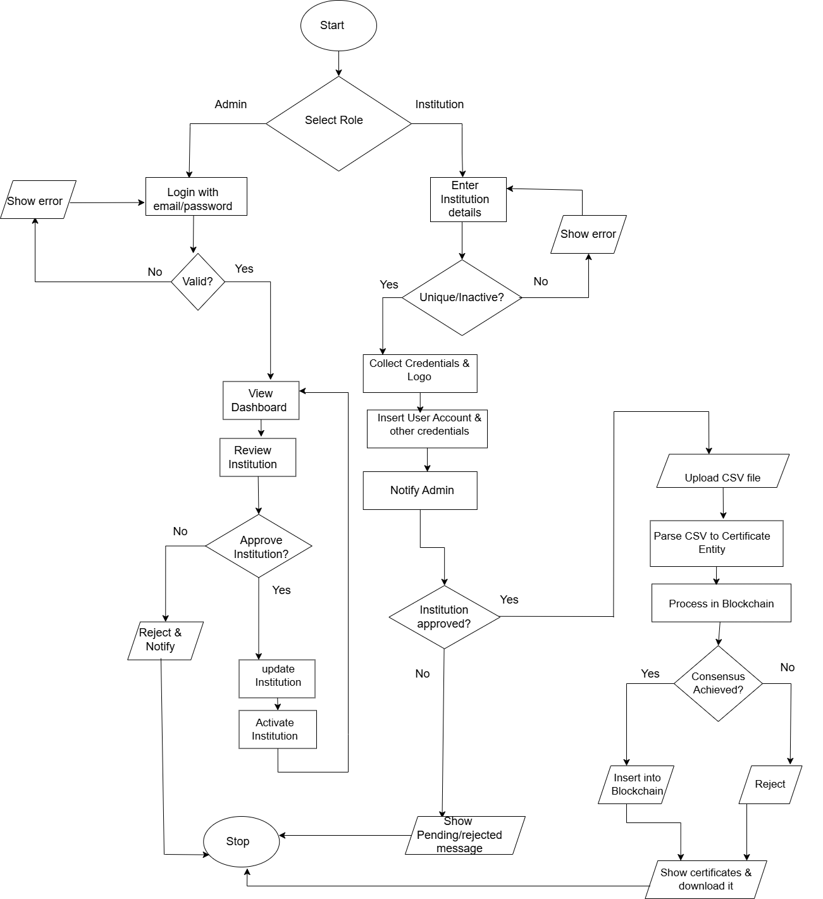
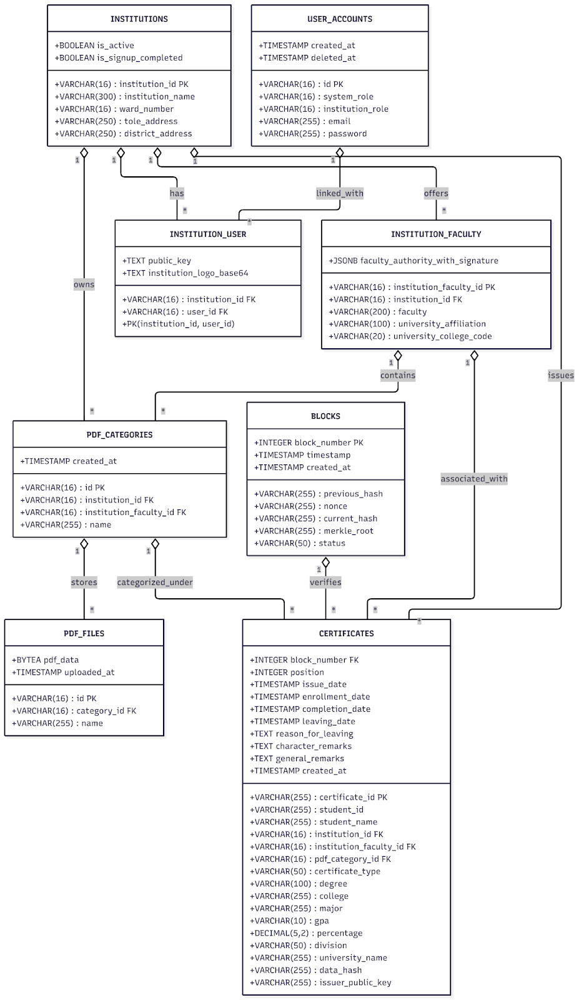

# 🎓 Academic Certificate Blockchain  
### Private • Permissioned • Consortium Blockchain for Secure Certificate Issuance & Verification  
**Simplified PoW + PBFT Consensus • Merkle Tree Integrity • Semi-Decentralized Network**  

  
  
  

---

## 📌 Project Overview

A **private, permissioned consortium blockchain** designed specifically for **Nepalese academic institutions** to securely issue, store, and verify academic certificates with cryptographic guarantees.

This system combines the best of both worlds:
- 🔹 **Simplified Proof-of-Work (PoW)** – Tamper-evident block creation  
- 🔹 **Practical Byzantine Fault Tolerance (PBFT)** – Deterministic, final, and byzantine-fault-tolerant verification  
- 🌳 **Merkle Tree Roots** – Fast & efficient certificate integrity checks

> **No cryptocurrency • No public access • No mining rewards**  
> Perfect for trusted multi-institution academic ecosystems.

**🎥 Watch the Full Explanation (PoW + PBFT + Merkle Tree)**  

---
## 🔧 Advanced Technical Concepts & Techniques Implemented

| Category                      | Implementation Details                                                                                  |
|-------------------------------|---------------------------------------------------------------------------------------------------------|
| **Cryptography**              | • SHA-256 double hashing in PoW • RSA key pairs for digital signatures (instead of traditional MACs in PBFT) • Merkle Tree with SHA-256 for certificate integrity |
| **Consensus Security**       | • Full PBFT with **message signed using RSA private keys** on every Pre-Prepare/Prepare/Commit message (stronger authenticity than standard PBFT) |
| **Networking**                | • Custom TCP-based peer-to-peer communication between nodes • Real-time block & message broadcasting |
| **Tunneling & Public Access** | • **Pinggy.io** tunnel + dedicated Go reverse-proxy server for secure public QR-code verification endpoint |
| **Database Design**           | • 8 normalized PostgreSQL tables • Hashed passwords — never stored in plain text • Institution logos & authority signatures stored as **Base64-encoded** strings |
| **Certificate Pipeline**      | • Dynamic HTML → PDF generation using Go templates • “Download All Certificates as ZIP” feature in Flutter frontend |
| **Architecture**              | • Clean Architecture principles in Go backend • Separation of concerns: consensus, storage, API, certificate service layers |
| **Security Best Practices**   | • All sensitive operations signed and verified • Input validation + tamper detection via Merkle roots • Secure random nonce generation |
| **Inter-Process Communication (IPC)** | • Go calls Python as an external subprocess for image-background removal task • Go spawning a Python process for specialized ML/image tasks                |

---
**Result** : A production-grade, academically focused private blockchain with real-world security, verifiability, and usability — built entirely from scratch.

## 🏆 Key Features

| Feature                        | Description                                                                 |
|-------------------------------|-----------------------------------------------------------------------------|
| 🔐 **Private & Permissioned**     | Only authorized institutions/nodes can join                                 |
| 🏛 **Consortium Model**           | Semi-decentralized across trusted nodes        |
| ⚡ **Dual Consensus**             | PoW for insertion → PBFT+POW for final verification                            |
| 🌳 **Merkle Tree Proofs**         | Efficient certificate verification without full block scan      |
| ✅ **Tamper-Proof Ledger**        | Hash-chained blocks + Merkle root integrity                                |
| 📱 **QR-Code Verification**      | Instant certificate authenticity check via web/mobile                      |
| 🔒 **Byzantine Fault Tolerance** | Tolerates up to **f = 1** malicious node for my 4 nodes (using PBFT)                      |

---

## 🛠 Tech Stack

| Layer         | Technology                                                                 |
|:-------------|:---------------------------------------------------------------------------|
| Backend       | **Go (Golang)** – Core blockchain logic, TCP networking,RSA keys,SHA-256       |
| Database      | **PostgreSQL** – 8 normalized tables for certificates & metadata           |
| Frontend      | **Flutter** – web UI                              |
| Certificate Generation | **HTML + Go templates + CSS** – Dynamic PDF-ready certificates     |
| Image Processing | **Python** – Background removal for logos & signatures                  |
| Testing       | **Postman** – API route testing                                            |
| IDE & Diagramming | **VS Code**, **Draw.io**                                              |

---
# ⭐ Diagrams & Architecture:

### Flowchart:(Frontend->Backend):

### Class Diagram:

---

## Future Enhancements

 - Dynamic PoW difficulty adjustment
 - PBFT View-Change protocol (leader failure recovery)
 - Support for 10+ institutional nodes
 - Public web dashboard for certificate verification
 - Off-chain storage (IPFS/Arweave) for large attachments
